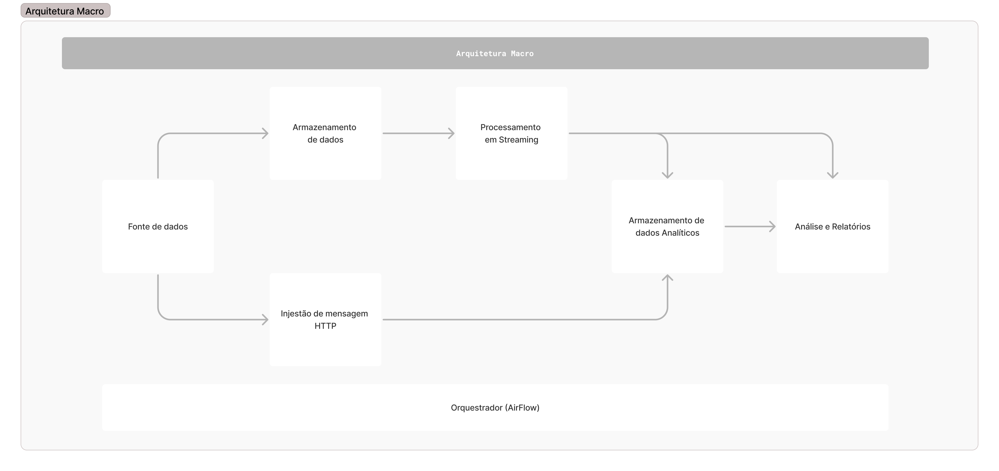
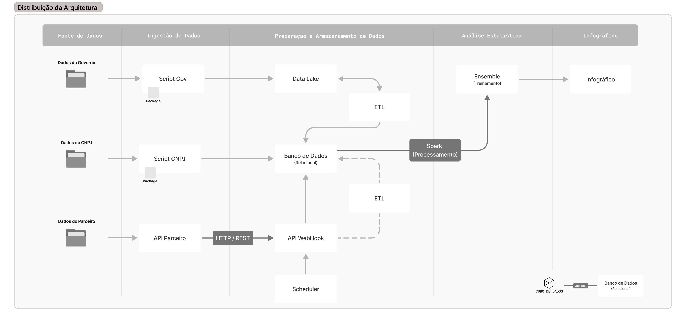
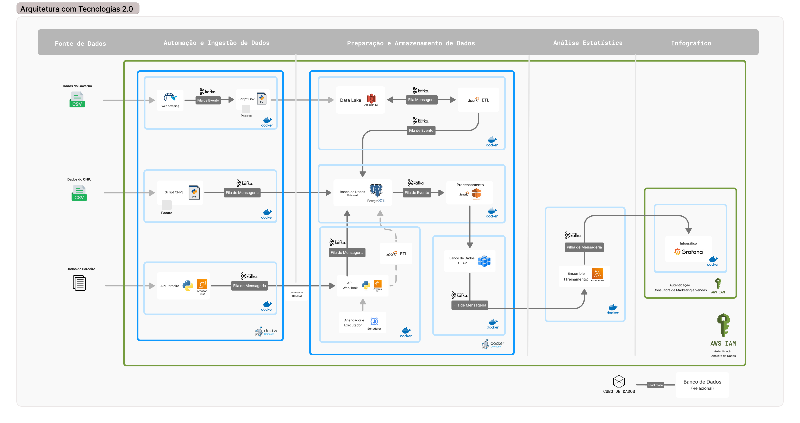
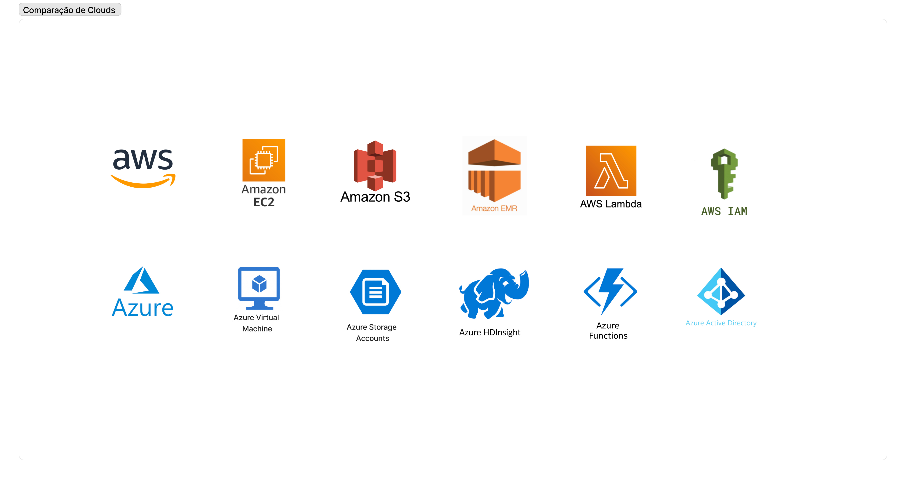

# Desenho de Arquitetura de Solução

Esta arquitetura foi construida através de uma colaboração, contando com a contribuição dos membros do Time 2 e 4. Além disso, a orientação dos professores, José Romualdo e Afonso Brandão.

## 1. Requisitos do pipeline de dados

Um pipeline de dados é um conjunto de processos e ferramentas que permitem a coleta, processamento, armazenamento e análise de grandes volumes de dados.Apresenta-se abaixo os requisitos estabelecidos para este projeto: 

**Fontes de Dados:** Os dados provêm de três fontes distintas - dados de pesquisas do governo, informações de CNPJs e dados fornecidos pelo parceiro que solicitou a análise.

**Volume de Dados:** O volume de dados varia dependendo das contribuições do parceiro e do crescimento contínuo ao longo dos anos nos dados governamentais e de CNPJs. Em média, se planeja suportar um volume de dados que varia de 6 a 10 gigabytes nesta aplicação.

**Velocidade de Ingestão:** Os dados são transmitidos via streaming, onde os fluxos são processados durante a visualização das informações do infográfico. A arquitetura foi projetada com serviços que garantem esse processamento ágil.

**Transformação e Processamento:** Os dados chegam em um formato não estruturado e, durante o processamento, eles são transformados em tabelas estruturadas. Além disso, aplica-se procedimentos de limpeza, verificação de integridade e remoção de dados indesejáveis, incluindo aqueles de origem estrangeira.

**Armazenamento:** O armazenamento dos dados ocorre em um banco de dados relacional, hospedado na AWS Cloud. No entanto, a arquitetura foi concebida para permitir a portabilidade para outras plataformas de nuvem, fazendo amplo uso de serviços de código aberto.

**Segurança:** A segurança é mantida por meio de autenticação, com dois níveis distintos. O primeiro nível é para acesso às informações do infográfico, enquanto o segundo abrange toda a parte técnica dos dados, incluindo ingestão, armazenamento e análise estatística. Para implementação utiliza-se o AWS IAM, o que proporciona a flexibilidade de migrar esse serviço para outras plataformas de nuvem, caso necessário.

**Escalabilidade:** Com foco na escalabilidade e na gestão da demanda, após o processamento, os dados são armazenados em um banco de dados OLAP. Mesmo com grandes volumes de dados, se consegue gerenciar as requisições, pela arquitetura ser modular. O uso de contêineres Docker permite manutenção individualizada, com as requisições sendo armazenadas em filas de mensagens e eventos.

## 2. Identificação dos dados de entrada e saída

A identificação dos dados de entrada e saída é utilizado para esclarecer como os dados fluem através do sistema.  

### 2.1 Dados de Entrada

**Fontes de Dados:** Os dados de entrada provêm de três principais fontes:

- Dados de pesquisas do governo.
- Dados de CNPJs.
- Dados fornecidos pelo parceiro.
  
**Formato dos Dados de Entrada** Os dados de entrada são, em sua maioria, não estruturados e podem incluir textos, números e informações variadas.

**Método de Ingestão:** Os dados de entrada são transmitidos em tempo real por meio de um sistema de ingestão de dados em streaming.

### 2.2 Dados de Saída

**Infográfico:** A principal saída da aplicação é a apresentação de um infográfico, que oferece insights visuais com base nos dados processados.

**Formato dos Dados de Saída:** Os dados de saída serão apresentados em um formato visual, como gráficos.

**Destino dos Dados de Saída:** Os dados processados e transformados são exibidos ao usuário final por meio de uma interface.

## 3. Análise das necessidades e objetivos do pipeline

A análise das necessidades e objetivos do pipeline auxilia na definição das diretrizes e no planejamento do sistema. Esta seção detalha as necessidades e metas do pipeline de dados:

### 3.1 Necessidades

**Coleta de Dados:** O pipeline deve ser capaz de coletar dados de fontes diversas, como dados governamentais, CNPJs e dados do parceiro, de forma confiável, garantindo a integridade e qualidade dos dados.

**Processamento:** Dada a geração do infográfico, é essencial processar dados em tempo real para fornecer insights atualizados aos usuários.

**Transformação e Limpeza de Dados:** É necessário aplicar transformações e limpeza aos dados não estruturados, incluindo a estruturação em tabelas e a remoção de dados indesejáveis.

**Armazenamento:** Os dados processados devem ser armazenados de forma segura em um banco de dados relacional hospedado na AWS Cloud, garantindo que estejam disponíveis quando necessário.

**Portabilidade e Flexibilidade:** A arquitetura deve ser projetada para permitir a portabilidade para outras nuvens, fazendo uso de serviços de código aberto, caso haja necessidade de migração futura.

**Segurança em Duas Camadas:** Implementação de dois níveis de segurança, com autenticação para acesso às informações do infográfico e autenticação separada para as operações técnicas do pipeline, garantindo a segurança contra acessos não autorizados.

**Escalabilidade:** A arquitetura deve ser escalável para acomodar volumes de dados crescentes e manter o desempenho, mesmo com um grande volume de informações.

### 3.2 Objetivos

**Infográfico:** O principal objetivo é fornecer um infográfico interativo que apresente informações de forma visual e acessível aos usuários.

**Tomada de Decisão:** Auxiliar na tomada de decisões com base nas informações apresentadas no infográfico.

**Migração Simples:** Permitir a migração dos serviços para outras plataformas de nuvem, afim de garantir a continuidade dos negócios em outros ambientes.

**Gerenciamento de Dados:** Gerenciar os dados de forma a armazenar em um banco de dados OLAP, além de usar contêineres Docker para manutenção modularizada.

## 4. Escolha de serviços adequados para cada etapa do pipeline

### 4.1 Fonte de Dados

- **Dados Governamentais:** Dados em formato CSV de fontes governamentais e sites para pegar novos dados quando tiver atualizações ou para consultas futuras.
- **Dados do CNPJ:** Dados de empresas em formato CSV, incluindo informações sobre CNPJ, setor e localização.
- **Dados do Parceiro:** Informações de parceiros externos através da API, requisições GET.
  
### 4.2 Automação de Ingestão

**Web Scraping (Python):** Extração de dados da web usando scripts Python para coletar informações relevantes. Utilizado para consultar se existe atualizações nos dados do governo e baixar os novos arquivos. (É um desejável para a aplicação não sendo comtemplado no escopo inicial). 

**AWS EC2:** Servidor virtual da Amazon Web Services hospedando a API do parceiros.

**Kafka:** Plataforma de streaming de dados para coleta, processamento e distribuição em tempo real.

### 4.3 Preparação & Armazenamento:

**AWS S3 (DataLake):** Serviço de armazenamento escalável da AWS para dados brutos antes do processamento.

**ETL com Apache Spark:** Realiza operações de Extração, Transformação e Carga nos dados armazenados no AWS S3.

**PostgreSQL:** Banco de dados relacional usado para armazenar dados processados e deixa-los disponíveis para consulta.

**Banco de Dados OLAP:** Banco de dados otimizado para análise de dados no formato OLAP (Online Analytical Processing).

### 4.4 Análise e Infográfico

**AWS Lambda:** Executa o processo de Ensemble, que envolve a combinação de modelos para análise estatística.

**Grafana:** Plataforma de visualização e análise de métricas, utilizada para a criação de dashboards interativos e relatórios.

### 4.5 Segurança

**AWS IAM (Identity and Access Management):** Gerencia a autenticação de usuários, controlando o acesso aos recursos da AWS, garantindo a segurança dos dados e recursos.

## 5. Justificativa para a escolha dos serviços

A escolha dos serviços nesta arquitetura de Big Data foi planejada considerando principalmente a portabilidade, a ênfase na AWS como principal nuvem, a flexibilidade de custos e a otimização de recursos. Abaixo apresenta separado em tópicos a justificativa para essa seleção:

**Portabilidade:** A maior parte dos serviços foi escolhida com a portabilidade em mente, evitando depender de soluções proprietárias. Isso permite que a arquitetura seja facilmente migrada para outras plataformas de nuvem, se necessário. 

**Uso de Open Source:** A preferência por tecnologias de código aberto proporciona flexibilidade e custos potencialmente mais baixos.

**AWS Cloud:** A AWS foi escolhida como a principal nuvem para atender ao escopo inicial do projeto. No entanto, a arquitetura foi planejada de forma a ser portável, o que significa que, se o cliente decidir migrar para outra nuvem no futuro, a transição será suave e eficiente, minimizando a interrupção dos serviços.

**Flexibilidade de Custos:** Dado que o cliente não estabeleceu um orçamento específico para a arquitetura, a escolha de serviços também considerou a otimização de custos. A seleção de ferramentas de código aberto e a capacidade de dimensionar recursos conforme necessário permitem que o cliente controle e otimize os custos à medida que o projeto evolui. 

### 5.1 Justificativas específicas

**Automação de Ingestão:** O uso do Web Scraping e do Kafka oferece flexibilidade e capacidade de escalonamento, atendendo à necessidade de coletar dados em streaming.

**Preparação & Armazenamento:** A combinação do AWS S3 para armazenamento e do Apache Spark para ETL permite processar dados de forma escalável, enquanto o PostgreSQL oferece um curto custo para armazenamento de dados processados.

**Análise:** O AWS Lambda e o Grafana foram escolhidos para análise e visualização de dados devido à sua flexibilidade na criação de dashboards e relatórios.

**Segurança:** O uso do AWS IAM atende à necessidade de gerenciamento de autenticação e controle de acesso, garantindo a segurança dos recursos.

## 6. Representação visual do pipeline

Neste contexto, se detalha a distribuição dos estágios da arquitetura de forma macro, abordando a conexão desde a aquisição de dados, a fase de ingestão, o armazenamento, o processamento, a análise estatística até a geração de relatórios, destacando a interconexão e fluxo contínuo entre essas etapas.

Aqui, se descreve as responsabilidades de cada estágio, fornecendo uma visão detalhada do que será executado em cada um. A imagem ilustra a estrutura minuciosa de cada estágio, como os blocos se encaixam no sistema e o processo que leva à criação do infográfico, sem entrar em detalhes sobre as tecnologias específicas utilizadas.

Finalmente, demonstra-se a composição da arquitetura construída, incluindo as especificações de todas as tecnologias mencionadas nos tópicos apresentados. Além disso, a arquitetura é modularizada, com a utilização de contêineres Docker, separando os serviços da AWS, tecnologias de código aberto, filas de mensagens e detalhando as especificações das requisições.

A seguir, apresenta-se uma comparação dos serviços utilizados na arquitetura que atualmente fazem uso da infraestrutura na nuvem da AWS, juntamente com suas correspondentes alternativas na nuvem da Azure. Essa comparação assume que o cliente planeja realizar a migração para a plataforma Azure em um momento futuro, exigindo uma compreensão das alternativas disponíveis para uma transição suave.

## 7. Consideração de boas práticas para garantir resiliência e escalabilidade

Garantir a resiliência e escalabilidade é fundamental em qualquer arquitetura de Big Data para lidar com o crescimento de dados e as demandas variáveis. Apresenta-se abaixo as medidas tomadas nesse projeto: 

**Arquitetura Modularizada:** A arquitetura foi projetada de forma modular, com componentes independentes que podem ser escalados e mantidos separadamente. Isso permite que recursos sejam alocados onde mais são necessários, sem impactar o funcionamento de todo o sistema.

**Escalabilidade Horizontal:** A capacidade de escalabilidade horizontal foi incorporada na seleção de serviços. Os contêineres Docker, por exemplo, facilitam a adição de recursos à medida que a demanda aumenta.

**Serviços de Nuvem:** O uso de serviços em nuvem, como AWS S3 e AWS EC2, proporciona uma escalabilidade sob demanda, permitindo expandir ou reduzir recursos conforme necessário. Além disso, essas plataformas oferecem alta disponibilidade e redundância, contribuindo para a resiliência.

**Recuperação de Falhas:** Planejar estratégias de recuperação de falhas, como redundância de dados e backups regulares, para garantir a recuperação eficaz em caso de problemas. 

## 8. Uso de serviços ou recursos da AWS que suportem resiliência e escalabilidade

Ao projetar esta arquitetura de Big Data, foram incorporados serviços e recursos da Amazon Web Services (AWS) que contribuem para garantir a resiliência e escalabilidade do pipeline de dados:

**Amazon EC2 (Elastic Compute Cloud):** Serviço de computação em nuvem que fornece servidores virtuais escaláveis. Ele oferece a capacidade de dimensionar horizontalmente as instâncias para atender à demanda.

**Amazon EMR (Elastic MapReduce):** Serviço de gerenciamento de clusters que facilita a execução de frameworks de processamento de big data, como o Spark.

**Amazon S3:** Serviço de armazenamento escalável, fornece redundância de dados e replicação entre várias zonas de disponibilidade.

**AWS Lambda:** Permite a execução de código em resposta a eventos. Ele pode ser usado para lidar com tarefas de processamento de dados, com base na demanda.

**AWS Identity and Access Management (IAM):** Utilizado para a segurança e a resiliência da arquitetura, permitindo o gerenciamento de permissões e a autenticação dos usuários, garantindo o acesso controlado aos recursos da AWS.

## 9. Calculadora financeira

Para garantir a transparência e o controle dos custos na utilização de serviços em nuvem, é recomendável o uso de calculadoras financeiras. Essas ferramentas ajudam a estimar e gerenciar os gastos com a infraestrutura em nuvem. Aqui estão algumas considerações sobre o uso dessas calculadoras financeiras:

**AWS Simple Monthly Calculator:** A AWS oferece o "Simple Monthly Calculator", uma ferramenta online que permite estimar os custos mensais com base nos serviços e recursos selecionados. 

**Azure Pricing Calculator:** A Microsoft Azure disponibiliza a "Azure Pricing Calculator", que permite estimar os custos mensais na plataforma Azure. A calculadora oferece uma visão geral dos preços dos serviços, permitindo configurar cenários específicos e avaliar os custos associados a máquinas virtuais, armazenamento, bancos de dados e outros recursos.

**Comparação de Custos:** Além de calcular os custos em cada plataforma individualmente, é recomendável usar ferramentas de comparação de custos, como o "AWS Total Cost of Ownership (TCO) Calculator" e o "Azure TCO Calculator". 

## 10. Referências

COMMUNITY REVELO. Arquitetura de Big Data: o que é? [S.l.], 2021. Disponível em: https://community.revelo.com.br/arquitetura-de-big-data-o-que-e/. Acesso em: 27 out. 2023.

MICROSOFT. Big Data Architecture Guide. [S.l.], 2023. Disponível em: https://learn.microsoft.com/pt-br/azure/architecture/data-guide/big-data/. Acesso em: 27 out. 2023.

MICROSOFT. Big Data Architecture Styles. [S.l.], 2023. Disponível em: https://learn.microsoft.com/pt-br/azure/architecture/guide/architecture-styles/big-data/. Acesso em: 27 out. 2023.

LOPES, Fábio Augusto de Carvalho. Arquitetura Big Data: escolha a canalização correta para sua empresa! [S.l.], 2019. Disponível em: https://www.linkedin.com/pulse/arquitetura-big-data-escolha-canalização-correta-para-lopes/?originalSubdomain=pt. Acesso em: 27 out. 2023.

AWARI EDUCATION. Arquitetura de Big Data: modelos e implementações [S.l], 2019. Disponível em: https://awari.com.br/arquitetura-de-big-data-modelos-e-implementacoes-11/. Acesso em: 27 out. 2023.

AMAZON WEB SERVICES. Arquitetura de dados moderna na AWS. [S.l.], 2023. Disponível em: https://aws.amazon.com/pt/big-data/datalakes-and-analytics/modern-data-architecture/. Acesso em: 27 out. 2023.

AMAZON WEB SERVICES. Arquitetura referência de análise de dados sem servidor na AWS. [S.l.], 2023. Disponível em: https://aws.amazon.com/pt/blogs/aws-brasil/arquitetura-referencia-de-analise-de-dados-sem-servidor-na-aws/. Acesso em: 27 out. 2023.

## 11. Link do arquivo da arquitetura. 

<a href="https://www.figma.com/file/f1UlbEj3DkiHD6sSFCGhR4/Ponderada-PRM?type=whiteboard&node-id=0%3A1&t=WtqJfGxg0D8ffKmi-1">Arquitetura Big Data (Figma Jam)</a>
